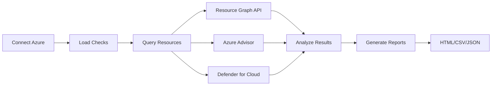

# Azure Well-Architected Framework Scanner


A comprehensive PowerShell-based tool for scanning Azure subscriptions against the Microsoft Well-Architected Framework. Generate detailed reports with actionable recommendations, remediation scripts, and compliance mappings.

[Quick Start](#-quick-start-5-minutes) • [Features](#-features) • [Documentation](#-documentation) • [Examples](#-usage-examples) • [Contributing](#-contributing)

---

## 🚀 Quick Start (5 Minutes)

### Prerequisites
- PowerShell 7.0+ ([Download](https://github.com/PowerShell/PowerShell/releases))
- Azure subscription with Reader access
- Azure PowerShell modules (auto-installed if missing)

### Installation

```powershell
# 1. Clone the repository
git clone https://github.com/dsvoda/Azure-WAF-Scanner.git
cd Azure-WAF-Scanner

# 2. Connect to Azure
Connect-AzAccount

# 3. Run your first scan
./run/Invoke-WafLocal.ps1 -EmitHtml
```

**That's it!** Your HTML report will be in `./waf-output/`

### Your First Report

Open the generated HTML file in your browser to see:
- 📊 **Executive Summary** with compliance score
- 🎯 **Priority Recommendations** by severity
- 📈 **Visual Charts** showing status by pillar
- 🔍 **Detailed Findings** with remediation steps
- 💡 **Quick Wins** for easy improvements

---

## ✨ Features

<table>
<tr>
<td width="33%">

### 🎯 Complete Coverage
- ✅ 60 checks across all 5 WAF pillars
- ✅ Maps to Microsoft's official recommendations
- ✅ Aligned with Azure Advisor
- ✅ Compliance framework mappings

</td>
<td width="33%">

### 📊 Rich Reporting
- ✅ Interactive HTML dashboards
- ✅ JSON/CSV for automation
- ✅ Word documents (DOCX)
- ✅ Baseline comparison
- ✅ Trend analysis

</td>
<td width="33%">

### ⚡ High Performance
- ✅ Parallel subscription scanning
- ✅ Intelligent query caching
- ✅ Resource Graph optimization
- ✅ Configurable throttling
- ✅ Retry logic with backoff

</td>
</tr>
</table>

### Supported Pillars

| Pillar | Checks | Focus Area |
|--------|--------|------------|
| 🛡️ **Reliability** | 10 | Availability, resilience, recovery |
| 🔐 **Security** | 12 | Identity, network, data protection |
| 💰 **Cost Optimization** | 14 | Budgets, right-sizing, reservations |
| 🔧 **Operational Excellence** | 12 | DevOps, automation, monitoring |
| ⚡ **Performance Efficiency** | 12 | Scaling, latency, throughput |

---

## 📸 Screenshots

### Interactive HTML Report

*Executive dashboard with compliance scores and priority recommendations*

### Detailed Findings View

*Filterable, sortable table with remediation scripts*

### Baseline Comparison

*Track improvements over time with trend analysis*

---

## 🎓 How It Works



1. **Authenticate:** Connect to your Azure subscription
2. **Discover:** Query resources using Azure Resource Graph
3. **Analyze:** Run 60 checks against WAF best practices
4. **Report:** Generate interactive reports with recommendations
5. **Remediate:** Execute provided PowerShell/CLI scripts

See [Architecture Documentation](docs/Architecture.md) for detailed diagrams.

---

## 📦 Installation Options

### Option 1: Git Clone (Recommended)
```powershell
git clone https://github.com/dsvoda/Azure-WAF-Scanner.git
cd Azure-WAF-Scanner
```

### Option 2: PowerShell Gallery (Coming Soon)
```powershell
Install-Module -Name AzureWAFScanner
Import-Module AzureWAFScanner
Invoke-WafScan -EmitHtml
```

### Option 3: Download ZIP
1. Download from [Releases](https://github.com/dsvoda/Azure-WAF-Scanner/releases)
2. Extract to your preferred location
3. Run `./run/Invoke-WafLocal.ps1`

### Required Permissions

Minimum Azure RBAC roles per subscription:
- ✅ **Reader** - Resource inventory and configuration
- ✅ **Security Reader** - Microsoft Defender insights
- ✅ **Cost Management Reader** - Cost and usage data

---

## 💻 Usage Examples

### Basic Scan
```powershell
# Scan current subscription with HTML report
./run/Invoke-WafLocal.ps1 -EmitHtml
```

### Multiple Subscriptions
```powershell
# Scan specific subscriptions in parallel
$subscriptions = @(
    "sub-prod-001",
    "sub-prod-002",
    "sub-uat-001"
)

./run/Invoke-WafLocal.ps1 `
    -Subscriptions $subscriptions `
    -Parallel `
    -EmitHtml `
    -EmitCsv `
    -EmitJson
```

### Custom Configuration
```powershell
# Use custom config with exclusions and thresholds
./run/Invoke-WafLocal.ps1 `
    -ConfigFile "./config-production.json" `
    -ExcludedPillars @('CostOptimization') `
    -EmitHtml `
    -OutputPath "./reports/$(Get-Date -Format 'yyyyMMdd')"
```

### Baseline Comparison
```powershell
# Create baseline
./run/Invoke-WafLocal.ps1 -EmitJson
Copy-Item "./waf-output/SUBID-*.json" "./baseline.json"

# Compare new scan to baseline
./run/Invoke-WafLocal.ps1 `
    -BaselineFile "./baseline.json" `
    -EmitHtml
```

### Security-Focused Scan
```powershell
# Only run security and reliability checks
./run/Invoke-WafLocal.ps1 `
    -ExcludedPillars @('CostOptimization','OperationalExcellence','PerformanceEfficiency') `
    -ObfuscateSensitiveData `
    -EmitHtml `
    -EmitDocx
```

---

## ⚙️ Configuration

### Basic Configuration File
Create `config.json` to customize scanner behavior:

```json
{
  "excludedPillars": [],
  "excludedChecks": ["CO-011", "PE-012"],
  "customThresholds": {
    "costManagement": {
      "monthlyBudgetWarningPercent": 80,
      "unusedResourceAgeDays": 30
    },
    "security": {
      "certificateExpiryDaysWarning": 30,
      "passwordExpiryDaysWarning": 90
    }
  },
  "resourceFilters": {
    "excludeTags": ["Environment=Dev", "Temporary=True"],
    "excludeResourceGroups": ["NetworkWatcherRG", "MC_*"]
  },
  "performance": {
    "parallelSubscriptions": true,
    "maxParallelism": 5,
    "timeoutSeconds": 300
  },
  "caching": {
    "enabled": true,
    "durationMinutes": 30
  }
}
```

See [Configuration Guide](docs/Configuration.md) for complete reference.

---

## 📊 Output Formats

### HTML Report (Interactive)
```powershell
./run/Invoke-WafLocal.ps1 -EmitHtml
```
**Features:**
- Executive summary dashboard
- Interactive filtering and sorting
- Visual compliance charts
- Expandable detail sections
- Export to CSV functionality
- Print-optimized layout

### JSON (Automation)
```powershell
./run/Invoke-WafLocal.ps1 -EmitJson
```
**Use cases:**
- CI/CD pipeline integration
- Baseline storage
- Custom reporting tools
- API integration

### CSV (Analysis)
```powershell
./run/Invoke-WafLocal.ps1 -EmitCsv
```
**Use cases:**
- Excel analysis
- Power BI import
- Bulk data processing
- Compliance tracking

### DOCX (Documentation)
```powershell
./run/Invoke-WafLocal.ps1 -EmitDocx
```
**Use cases:**
- Executive presentations
- Audit documentation
- SharePoint uploads
- Email distribution

---

## 🎯 Command-Line Options

### Required Parameters
| Parameter | Type | Description |
|-----------|------|-------------|
| `-Subscriptions` | string[] | Subscription IDs or names to scan |

### Output Options
| Parameter | Type | Description |
|-----------|------|-------------|
| `-EmitHtml` | switch | Generate interactive HTML report |
| `-EmitJson` | switch | Generate JSON output |
| `-EmitCsv` | switch | Generate CSV output |
| `-EmitDocx` | switch | Generate Word document |
| `-OutputPath` | string | Output directory (default: ./waf-output) |

### Performance Options
| Parameter | Type | Description |
|-----------|------|-------------|
| `-Parallel` | switch | Process subscriptions in parallel |
| `-MaxParallelism` | int | Max parallel threads (default: 5) |
| `-TimeoutSeconds` | int | Check timeout (default: 300) |
| `-RetryAttempts` | int | API retry attempts (default: 3) |

### Filtering Options
| Parameter | Type | Description |
|-----------|------|-------------|
| `-ExcludedPillars` | string[] | Pillars to skip |
| `-ExcludedChecks` | string[] | Specific check IDs to skip |
| `-ConfigFile` | string | Path to configuration file |

### Advanced Options
| Parameter | Type | Description |
|-----------|------|-------------|
| `-BaselineFile` | string | Compare with baseline scan |
| `-DryRun` | switch | Show what would be scanned |
| `-ObfuscateSensitiveData` | switch | Remove sensitive data from reports |
| `-Verbose` | switch | Enable detailed logging |

See [API Reference](docs/API-Reference.md) for complete parameter documentation.

---

## 🔧 Creating Custom Checks

Add organization-specific checks to extend the scanner:

### Step 1: Create Check Directory
```powershell
mkdir modules/Pillars/Security/SE-099
```

### Step 2: Create Check Script
```powershell
# modules/Pillars/Security/SE-099/Invoke.ps1

Register-WafCheck -CheckId 'SE-099' `
    -Pillar 'Security' `
    -Title 'Custom Security Check' `
    -Description 'Validates custom security requirements' `
    -Severity 'High' `
    -RemediationEffort 'Medium' `
    -DocumentationUrl 'https://your-docs.com/custom-check' `
    -ScriptBlock {
        param([string]$SubscriptionId)
        
        # Your check logic here
        $query = @"
Resources
| where subscriptionId == '$SubscriptionId'
| where type == 'microsoft.compute/virtualmachines'
| where properties.licenseType != 'Windows_Server'
| project id, name, location
"@
        
        $results = Invoke-AzResourceGraphQuery -Query $query `
            -SubscriptionId $SubscriptionId -UseCache
        
        if ($results.Count -eq 0) {
            return New-WafResult -CheckId 'SE-099' `
                -Status 'Pass' `
                -Message 'All VMs using Azure Hybrid Benefit'
        } else {
            return New-WafResult -CheckId 'SE-099' `
                -Status 'Fail' `
                -Message "Found $($results.Count) VMs not using Azure Hybrid Benefit" `
                -AffectedResources $results.id `
                -Recommendation 'Enable Azure Hybrid Benefit to reduce licensing costs' `
                -RemediationScript @'
$vms = Get-AzVM | Where-Object { $_.LicenseType -ne 'Windows_Server' }
$vms | ForEach-Object {
    $_.LicenseType = 'Windows_Server'
    Update-AzVM -VM $_ -ResourceGroupName $_.ResourceGroupName
}
'@
        }
    }
```

### Step 3: Test Your Check
```powershell
# Test locally
./run/Invoke-WafLocal.ps1 -Verbose
```

See [Development Guide](docs/Development.md) for detailed instructions.

---

## 📚 Documentation

| Document | Description |
|----------|-------------|
| [Architecture](docs/Architecture.md) | System design and data flow |
| [Development Guide](docs/Development.md) | Creating custom checks |
| [Configuration Reference](docs/Configuration.md) | Complete config options |
| [Check Registry](docs/CheckID-Registry.md) | All 60 checks documented |
| [Compliance Mappings](docs/Compliance-Mappings.md) | CIS, NIST, ISO, PCI-DSS |
| [API Reference](docs/API-Reference.md) | Function documentation |
| [Troubleshooting](docs/Troubleshooting.md) | Common issues and solutions |
| [Performance Guide](docs/Performance-Guide.md) | Optimization tips |
| [Security](docs/Security.md) | Security considerations |

---

## 🚀 CI/CD Integration

### Azure DevOps Pipeline

```yaml
# azure-pipelines.yml
trigger:
  - main

schedules:
- cron: "0 2 * * 0"  # Weekly on Sunday at 2 AM
  displayName: Weekly WAF Scan
  branches:
    include:
    - main

pool:
  vmImage: 'windows-latest'

steps:
- task: AzurePowerShell@5
  displayName: 'Run WAF Scanner'
  inputs:
    azureSubscription: 'Azure-ServiceConnection'
    ScriptType: 'FilePath'
    ScriptPath: '$(System.DefaultWorkingDirectory)/run/Invoke-WafLocal.ps1'
    ScriptArguments: '-EmitJson -EmitHtml -EmitCsv'
    azurePowerShellVersion: 'LatestVersion'

- task: PublishBuildArtifacts@1
  displayName: 'Publish Reports'
  inputs:
    PathtoPublish: '$(System.DefaultWorkingDirectory)/waf-output'
    ArtifactName: 'WAF-Reports'

- task: PublishTestResults@2
  displayName: 'Publish Test Results'
  inputs:
    testResultsFormat: 'JUnit'
    testResultsFiles: '$(System.DefaultWorkingDirectory)/waf-output/*.xml'
    failTaskOnFailedTests: false
```

### GitHub Actions

```yaml
# .github/workflows/waf-scan.yml
name: Azure WAF Scan

on:
  schedule:
    - cron: '0 2 * * 0'  # Weekly on Sunday
  workflow_dispatch:

jobs:
  waf-scan:
    runs-on: windows-latest
    steps:
      - uses: actions/checkout@v3
      
      - name: Azure Login
        uses: azure/login@v1
        with:
          creds: ${{ secrets.AZURE_CREDENTIALS }}
      
      - name: Run WAF Scan
        shell: pwsh
        run: |
          ./run/Invoke-WafLocal.ps1 -EmitHtml -EmitJson -EmitCsv
      
      - name: Upload Reports
        uses: actions/upload-artifact@v3
        with:
          name: waf-reports
          path: waf-output/
      
      - name: Create Issue for Critical Findings
        if: failure()
        uses: actions/github-script@v6
        with:
          script: |
            github.rest.issues.create({
              owner: context.repo.owner,
              repo: context.repo.repo,
              title: '🚨 WAF Scan: Critical Findings Detected',
              body: 'Critical security or reliability issues found. Review artifacts.',
              labels: ['security', 'waf', 'critical']
            })
```

See [CI/CD Integration Examples](docs/cicd/) for more platforms.

---

## 🔍 Troubleshooting

### Common Issues

**Issue:** "Module Az.* not found"
**Solution:** Modules auto-install, or manually install:
```powershell
Install-Module Az -Scope CurrentUser -Force
```

**Issue:** "Access Denied" errors
**Solution:** Verify RBAC roles
```powershell
Get-AzRoleAssignment -SignInName (Get-AzContext).Account.Id
```

**Issue:** Resource Graph throttling
**Solution:** Enable caching in config.json
```json
{
  "caching": { "enabled": true, "durationMinutes": 30 },
  "performance": { "maxParallelism": 3 }
}
```

**Issue:** Checks timing out
**Solution:** Increase timeout
```powershell
./run/Invoke-WafLocal.ps1 -TimeoutSeconds 600
```

See [Troubleshooting Guide](docs/Troubleshooting.md) for complete solutions.

---

## 📈 Performance Benchmarks

| Subscription Size | Resources | Checks | Time | Optimized Time |
|------------------|-----------|--------|------|----------------|
| Small | < 100 | 60 | 3-5 min | 1-2 min |
| Medium | 100-500 | 60 | 7-12 min | 3-5 min |
| Large | 500-1000 | 60 | 15-25 min | 6-10 min |
| Enterprise | 1000+ | 60 | 30-45 min | 12-18 min |

*Optimized times with parallel execution and caching enabled*

See [Performance Guide](docs/Performance-Guide.md) for optimization strategies.

---

## 🤝 Contributing

We welcome contributions! Here's how to get started:

### Quick Contribution Guide

1. **Fork** the repository
2. **Create** a feature branch (`git checkout -b feature/amazing-check`)
3. **Add** your check following our [Development Guide](docs/Development.md)
4. **Test** thoroughly with Pester tests
5. **Commit** changes (`git commit -m 'Add amazing security check'`)
6. **Push** to your fork (`git push origin feature/amazing-check`)
7. **Submit** a pull request

### Contribution Areas

We especially welcome contributions in these areas:

- 🆕 **New Checks** - Custom organization checks
- 📚 **Documentation** - Improve guides and examples
- 🧪 **Tests** - Expand Pester test coverage
- 🐛 **Bug Fixes** - Address issues
- ✨ **Features** - New output formats, integrations
- 🌍 **Translations** - Localize documentation

### Development Setup

```powershell
# Clone your fork
git clone https://github.com/YOUR_USERNAME/Azure-WAF-Scanner.git
cd Azure-WAF-Scanner

# Install development dependencies
Install-Module Pester -Force
Install-Module PSScriptAnalyzer -Force

# Run tests
Invoke-Pester

# Run linter
Invoke-ScriptAnalyzer -Path . -Recurse
```

See [CONTRIBUTING.md](CONTRIBUTING.md) for detailed guidelines.

---

## 👥 Contributors

Thanks to these amazing people for their contributions!

<!-- ALL-CONTRIBUTORS-LIST:START -->
<table>
  <tr>
    <td align="center">
      <a href="https://github.com/dsvoda">
        
        <br /><sub><b>dsvoda</b></sub>
      </a>
      <br />
      <span title="Code">💻</span>
      <span title="Documentation">📖</span>
      <span title="Design">🎨</span>
    </td>
    <!-- Add more contributors here -->
  </tr>
</table>
<!-- ALL-CONTRIBUTORS-LIST:END -->

Want to be listed here? See [Contributing](#-contributing)!

---

## ⭐ Star History

[](https://star-history.com/#dsvoda/Azure-WAF-Scanner&Date)

If you find this project useful, please consider giving it a ⭐!

---

## 📜 License

This project is licensed under the MIT License - see the [LICENSE](LICENSE) file for details.

```
MIT License

Copyright (c) 2025 dsvoda

Permission is hereby granted, free of charge, to any person obtaining a copy
of this software and associated documentation files (the "Software"), to deal
in the Software without restriction...
```

---

## 📞 Support

### Getting Help

- 📖 **Documentation:** Check our [comprehensive docs](docs/)
- 🐛 **Issues:** [GitHub Issues](https://github.com/dsvoda/Azure-WAF-Scanner/issues)
- 💬 **Discussions:** [GitHub Discussions](https://github.com/dsvoda/Azure-WAF-Scanner/discussions)
- 📧 **Email:** Contact maintainers for enterprise support

### Reporting Issues

When reporting bugs, please include:
- PowerShell version (`$PSVersionTable`)
- Azure PowerShell version (`Get-Module Az -ListAvailable`)
- Error messages and stack traces
- Steps to reproduce
- Expected vs actual behavior

---

## 🗺️ Roadmap

### v1.1
- [ ] PowerShell Gallery publication
- [ ] Enhanced baseline comparison
- [ ] Power BI export templates
- [ ] Automated remediation runbooks

### v1.2
- [ ] Microsoft Defender for Cloud integration
- [ ] Multi-tenant scanning support
- [ ] Custom compliance frameworks
- [ ] REST API endpoint

### v2.0
- [ ] Web-based UI
- [ ] Real-time monitoring
- [ ] ML-powered recommendations
- [ ] SaaS offering

See [ROADMAP.md](ROADMAP.md) for detailed planning.

---

## 📊 Project Stats


---

<div align="center">

**Made with ❤️ by the Azure community**

[⬆ Back to Top](#azure-well-architected-framework-scanner)

</div>
